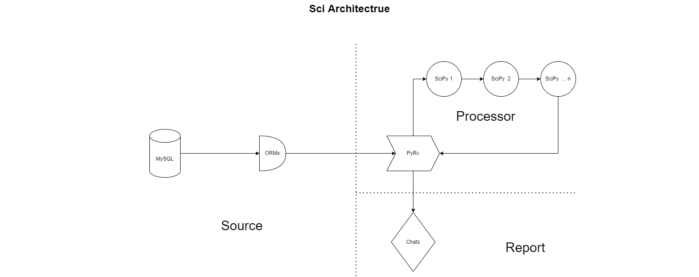

# NajaSci

A starter repo to handle statistic data for academic

## Architecture



## Docker

##### Build

 ```
 docker build -t bashe .
 ```

##### Run

```
docker run -it --rm --name bashe_run bashe
```